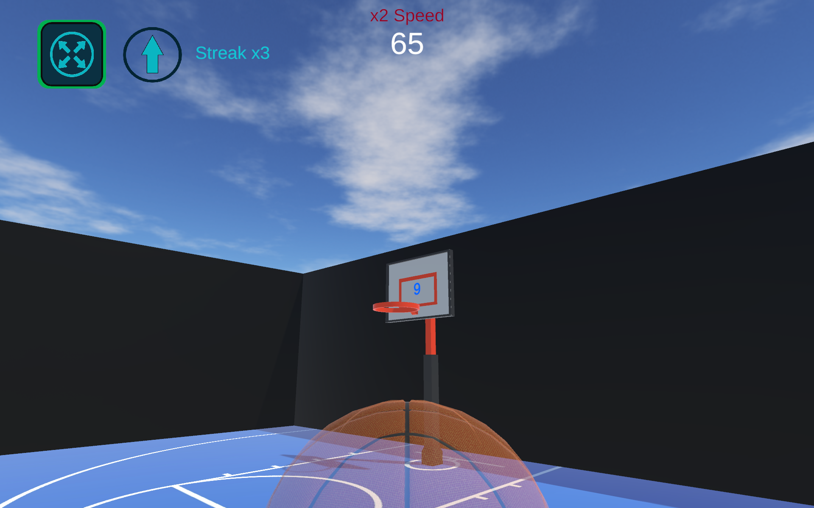
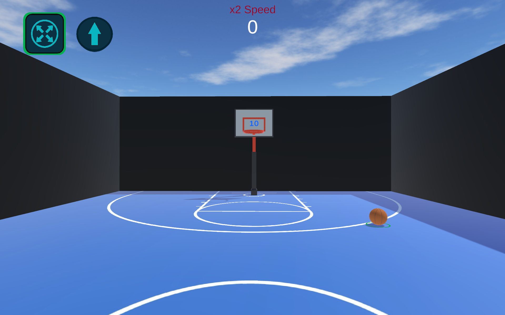

# TrickShot Trials

Physics-based basketball inspired game. Goal is to score as many balls as you can within the given time. If the timer runs out, you are out!

## Screenshots

## Gameplay Video

## How to Play

- Use WASD to move and hold down shift key to run.
- Pick up the next ball from the ground by walking onto it.
- Aim the ball by looking upper or lower.
- Throw by using the left mouse button.
- Jump before throwing to throw with more strength.
- You get a second go at the same ball if you miss. But remember : First shot baskets give extra time!
- Three misses and you get the heavy ball. Easier to score but lower reward. If missed, there is a penalty!
- Three successful baskets and you get the light ball. Harder to score but more rewarding!
- Streak reward time added on every consecutive basket after three in a row!
- Beware : The timer will go down twice as fast after a minute ends!

### Game Rules

- Player starts with one minute on the timer.
- Each successful basket adds time to the clock.
- If the timer reaches zero, the game ends.

### Powers

- There are two powers the player should utilize. Bigger rim and the throw force.
- Bigger rim : Expand the rim for a few seconds. But it costs you 5 seconds on the timer! (Activate with E key)
- Throw force : Use the F key to toggle throw force. When open you throw stronger!

> There are four different forces you can throw a ball with :

- Force inactive, grounded : Very low force
- Force active, grounded : Low force
- Force inactive, jumping : Medium force
- Force active, jumping : High force

> Different ball types act differently! In order to ensure success heavy ball must be thrown with mostly high force
and the light ball should be thrown with low force. But the distance also always matters!

#### Creators

- Bora Çakmak
- Selin Bolamat
